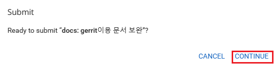

## gerrit 페이지
- <배정받은 ec2 url>:8989/

### gerrit 사용법
1. 처음 admin로그인
  아이디 비번 - 팀mm에 기록
2. 사용자 설정 바꾸기
  - 본인 할당 ssafy숫자로 로그인
  - 설정에서 프로필 수정
  - 
  - Email Address수정(인증메일이 원래는 가는게 맞으나 gerrit관리자 모드로 되어있어 실제로 인증메일이 가지는 않음)
  - 
  - 새로운 비밀번호 할당 -> **저장되지 않으므로 꼭 개인적으로 저장**
  - 

### 로컬 개발 환경 설정
  - git remote -v
  - 처음 clone받은 이후 remote해보면 다음과 같이 되어있음
  - 
  - gerrit과 연결되어 있는(EC2서버) 주소로 바꾸기 위해 하는 설정
  - git remote set-url origin "https://<gerrit_username>@<EC2 주소>:8989/a/<project명>"
  - 
    - username: 본인 할당 ssafy숫자
    - EC2 주소: mm공유
    - project명: 깃랩 혹은 gerrit레포 확인(이름 동일)

### push하는 법
- git add .
- git commit -m "컨벤션규칙"
- git push origin HEAD:refs/for/<branch명>
- push 규칙만 변화, push할 경우 본인이 원하는 branch가 맞는지 확인

### 코드리뷰 하는법
- gerrit 페이지를 확인해보면 다른 사람의 CR이 필요한 commit업데이트
- 
- Review 연필표시클릭
- 
- 점수를 준 이후 send
- 
- 다른 사람이 CR한 이후 본인것 확인 후 이상 없으면 submit 후 continue(gitlab에 적용)
- 
- 

## 주의사항
- git push origin <branch명>으로 바로 push하는 경우가 없도록 한다.
  - gitlab과 gerrit의 업데이트 이력이 서로 다른 경우 conflict발생 가능하기 때문 
- git push origin HEAD:refs/for/<branch명> -> 팀원에게 push한 내역이 있다고 말한다.
- gerrit이 서버에서 동작하지 않는 것 같다면 [gerrit 관련 명령어.txt](CodeReview_Gerrit_User_Guide_Code.txt)확인