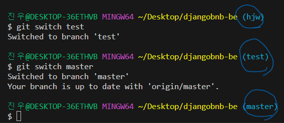
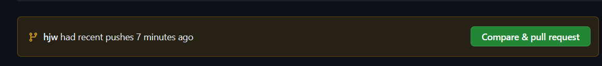
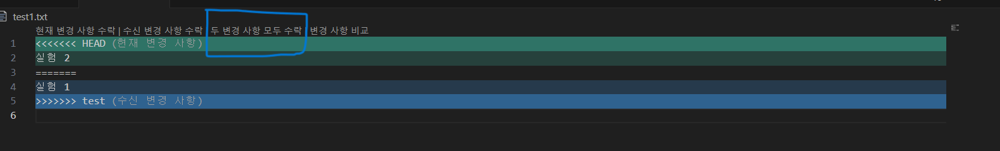
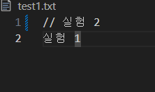

## 기본적인 이용사항
1. 자신의 branch 만들기(여기서 작업), 처음 master branch에 있는 commit 및 log를 가져오며 새로운 branch만들기
   - git branch **name** master ('name'은 자신이 정하는 이름)
   - git branch : 모든 branch확인
2. git switch **name** (bash에서 자신이 정한이름으로 바뀌었는지 확인)
   - 
   - 여기서 작업해야함 master에서 작업하다가 날라가면 ㅠ
3. git branch -d **name** :  merge작업이 끝난 branch삭제
4. git branch -D **name** :  강제 branch삭제

5. master branch에 적용 안하고 자신의 작업만 깃허브에 저장하고 싶을 경우
   - git add .
   - git commit -m ''
   - git push origin **name**
   - 이 과정은 **자신의 branch**에서

   
6. 자신의 branch에서 작업한 후 master branch에 변경사항 적용하고 싶은 경우
   1. 방법 1 (브랜치에서 작업한 것이 맞는지 확인후 master에 변경사항을 적용하는것이 좋음)
        1. git add .
        2. git commit -m ' '
        3. git push origin **name** -> master로 보내지 않음 자신의 브랜치에 수정사항 올림
        4. 깃허브 홈페이지에서 마스터 브랜치에 최종 변경사항 적용
        5. 
        6. 바로 적용하는 것이 아닌**꼭꼭 상의**
   2. 방법 2 (변경사항이 확실할시 올리는것도 가능하나 왠만하면 확인후 master에 올리는 과정 필요)
        1. git add .
        2. git commit -m ' '
        3. git switch master : 마스터 브랜치로 이동한후
        4. git merge **name** (이작업은 브랜치에서의 변경사항을 master로컬에 적용하는 과정)
        5. git add . /git commit -m '' /git push origin **master** 작업을 거쳐야 깃허브에 등록

7. **name**의 경우 자신의 브랜치를 뜻하며 master branch에 변경을 할시 팀원에게 알리는 과정이 필요하며
master의 변경사항이 있을때마다 pull해 오는 과정이 중요하므로 항시 master의 변경사항이 존재할시 팀원과 얘기!

- master branch에 변경사항이 있을시
  1. git pull origin master
  2. git switch **name**
  3. master의 변경사항 받아오는 방법
     1. git merge master  
     2. git rebase master
     3. 두가지 모두 꼭 master에서 변경사항이 아니라 다른 branch에서도 가지고 올 수 있음
    - 두가지의 차이점이 존재하나 아직 확실히 알고 난 이후 수정

# 주의

- 절대로 작업을 **master branch**에서 하지 않기
- 같은 파일을 작업시에 다음과 같은 상황이 발생할 수 있음   

  
- 하나만 받는것이 아닌 두개다 받은 이후 주석처리 혹은 다른 메모장에 작성해 둔 후 추후 팀원과 상의   
  
- 삭제를 해버릴 시에 다른 쪽 코드에서 오류가 발생할 수 있음