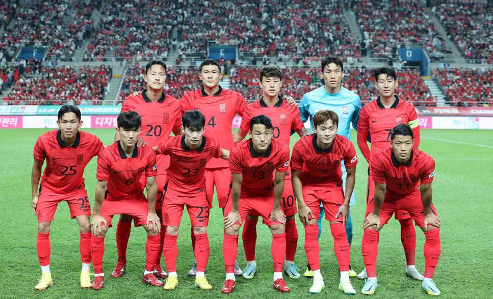
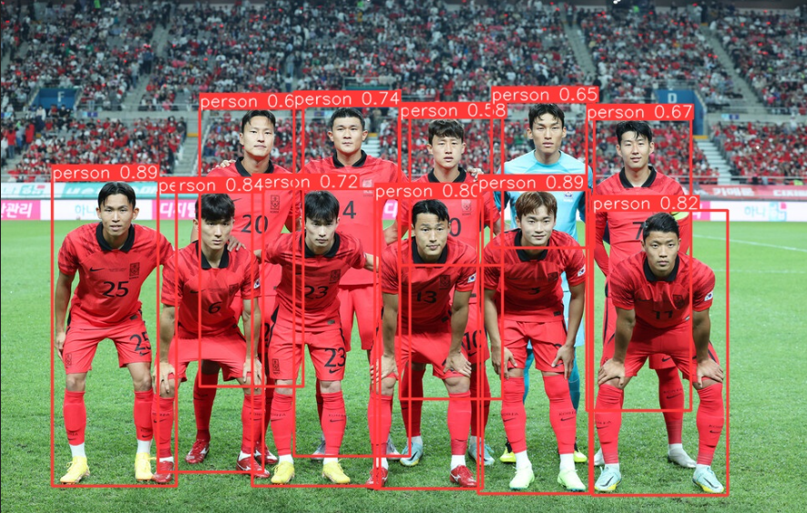

# 자율 2주차 (24.04.15 ~ 24.04.19)
- 한 주 진행 내용 
  - 팀 단위로 진행하는 기획 진행
  - 기존 주제 구체화 단계에서 향수 시각화 부분에 대한 문제점 발견
  - 새로운 주제 기획 회의
  - 제시, 투표, 토의 를 통한 최종 후보 정리 후 팀 미팅 진행
  - 팀 미팅 피드백을 검토하고 최종적으로 주제 확정
  - 확정한 주제 구체화 진행
  - 피드백에 따라 세부 기능 기획 후 프로그램 명세 작성
  - 프로그램을 나누는 기준에 대해 토의 
  - 추후 재사용성을 고려한 기준으로 프로그램 설정
  - 전체 일정을 오픈날짜를 기준으로 역순으로 짚어가며 일정 수립
  - 전체 일정을 짜는데 있어서 기술적 어려움이나 소요 시간 등을 쉽게 예측 할 수 없고, 분명 게획 일정에서 벗어날 수 밖에 없는 상황이 생길 것이라는 의견
  - 위 내용은 이슈 관리를 통해 해결하는 것으로 하고 전체 일정을 작성.
  - 하드웨어에 대한 토의 진행
  - 다음 주에 있을 중간 발표 관련 발표에 필요한 내용, 자료를 위해 회의 진행

# 자율 3주차
### 24.04.22

- 2차 교보재 신청서 작성
  - 객체 인식 후 트래킹 기능 관련 서보 모터와 해당 모터 구동에 필요한 PHb 등 스타터 팩 교보재 신청완료
  - 디스플레이 크기, 비율 을 결정하기 위해 회의 진행 후 제우스랩 z10T 제품으로 선정 후 신청완료
  - 잿슨나노에 연결할 카메라 관련 광각 제품과 오토 포커스 제품 중 하나를 선택하기위해 회의 진행 후 광각 제품으로 선정하여 신청완료 
  - 잿슨나노 수령 및 developer 사이트 접속하여 튜토리얼 및 기본 지원 확인
  - 잿슨나노 전원 어댑터 미포함 제품인 것을 확인하고 전원 어댑터도 추가로 교보재 신청

### 24.04.23
  - 게릿 푸시 확인 

### 24.04.24
  Pre-Trained YOLOv8 특정 사물만 인식하는 방법에 필요한 클래스(Class)는 아래의 80가지 클래스로 학습이 되어있습니다.

  분류는 아래와 같다. 

  names:
  0: person
  1: bicycle
  2: car
  3: motorcycle
  4: airplane
  5: bus
  6: train
  7: truck
  8: boat
  9: traffic light
  10: fire hydrant
  11: stop sign
  12: parking meter
  13: bench
  14: bird
  15: cat
  16: dog
  17: horse
  18: sheep
  19: cow
  20: elephant
  21: bear
  22: zebra
  23: giraffe
  24: backpack
  25: umbrella
  26: handbag
  27: tie
  28: suitcase
  29: frisbee
  30: skis
  31: snowboard
  32: sports ball
  33: kite
  34: baseball bat
  35: baseball glove
  36: skateboard
  37: surfboard
  38: tennis racket
  39: bottle
  40: wine glass
  41: cup
  42: fork
  43: knife
  44: spoon
  45: bowl
  46: banana
  47: apple
  48: sandwich
  49: orange
  50: broccoli
  51: carrot
  52: hot dog
  53: pizza
  54: donut
  55: cake
  56: chair
  57: couch
  58: potted plant
  59: bed
  60: dining table
  61: toilet
  62: tv
  63: laptop
  64: mouse
  65: remote
  66: keyboard
  67: cell phone
  68: microwave
  69: oven
  70: toaster
  71: sink
  72: refrigerator
  73: book
  74: clock
  75: vase
  76: scissors
  77: teddy bear
  78: hair drier
  79: toothbrush

  ### 24.04.25
  - 얼굴 객체 트레킹을 통한 좌표값을 받아와 모터를 제어할 수 있는 로직 설계 
  - 실제 잿슨나노 환경에서 모터를 연결해서 작동할 수 있는지는 확인이 필요함. 
  - 아직 잿슨나노 os 및 초기 환경 설정이 진행 중이라 실제 테스트는 추후에 진행할 것.
  - 모터 제어 방법 2가지 중 선택
    1. 잿슨나노에 직접 연결하여 PWM 제너레이터를 이용해 서보모터 제어
      - 40 pin header의 32, 33 번 핀 사용하여 연결
      - 내장 제어레이터 기능 실행하는 법. -> $ sudo /opt/nvidia/jetson-io/jetson-io.py

    2. 모터 드라이버를 통해 PWM 지원

  - 모터의 전원은 외부전원을 사용하는 것이 좋음. (전력 문제)
  - 각 장단점을 고려해보고 선택할 것.

### 24.04.26
  - 잿슨나노를 SSH 로 연결하여 잿슨나노 환경에서 yolov8 모델의 객체 인식을 실제로 구동해봄.
  - 현재 카메라와 디스플레이가 없는 관계로 학습된 모델의 input 으로 이미지 파일을 넣어주고 output 을 확인함.
  - 입력 사진
    

  - 출력
    

  - 디스플레이를 연결하고 show 를 통해 이미지 결과를 표시하려고 했는데, 메모리 초과 발생
  - 잿슨나노의 제한 적인 환경에 대해 더 조사하고, 메모리 초과 원인을 파악하여 모델 최적화 필요
    - 현재 단계에서는 아마 이미지를 show 하는 것 자체가 메모리에 많은 부분을 차지 한다고 판단. 실제 트래킹 동작은 이미지를 출력할 필요가 없음

  - 객체 인식과정에서 사람의 신체 전부를 사람이라고 인식하는 모델과 얼굴만을 인식하는 모델 중 선택이 필요함. 
    - 얼굴 인식 : 얼굴만을 인식하기 때문에 뒤에 액자를 이용하려는 사용자가 얼굴을 내비쳐야만 인식함. 얼굴 측면부 인식률이 떨어짐.
    - 신체 인식 : 얼굴이 보이지 않고 신체 일부가 보이더라도 객체로 인식함. 사용자가 멀리서 지나만 가도 객체로 인식되는 경우가 잦음. 

  - 결론 : 실제 잿슨나노 환경에서 yolov8 모델이 적합한가에 대한 고민이 필요

# 자율 4주차
### 24.04.29
- 경량화 모델인 cv2 라이브러리 모델과 같은 딥러닝 이지만 보다 빠르고 가벼운 mediapipe 모델을 통해 객체 인식 구현.
- 해당 모델이 잿슨나노 환경에서 더욱 빠르고 메모리 소비가 적은지 확인 시도
- 파이 카메라를 연결하여 영상 이미지를 확인하려고 했으나, 카메라 연결에 실패하여 모델 성능 확인 불가
- 로컬 랩탑에서 실행했을 때에는 객체 인식 정상 작동함. 
- 추후 웹캠을 연결하고나면 잿슨나노에서도 바로 확인이 가능할 것으로 보임. 
- ssh 를 사용한다고 해도, 실제 모터 구동과 코드를 실행하는데에는 잿슨나노가 1대 인것이 너무 불편함.

### 24.04.30
- yolo 모델은 매우 널리 사용되는 모델이면서 성능이 뛰어나고 경량화 버전이 다양하다.
- 잿슨나노에서 3가지의 인식이 진행되므로 메모리 사용을 최소화하는 경량화된 모델을 사용하기 위해 nano 버전을 서치해서 사용하는 것으로 진행.
- v5, v8 를 제작한 팀과는 아예 다른 팀이고 사용 방식 자제가 달라서 clone 이후 기학습 모델을 구동하는데 실패했다. 

### 24.05.02
- mediapipe 모델을 객체 인식 경량화 모델로 채택하고 해당 모델을 통해 좌표값을 계산, 모터 로직을 구현함.
- 일시적으로 모터 제어 이전 잿슨나노에 연결된 웹캠 통해 객체를 인식하고 좌표값을 계산할 수 있는지 잿슨나노 환경에서 구동해봄. (2번 카메라)
- numpy 버전 오류인지 의존성 충돌인지 명확히 할수 없는 원인으로 어트리뷰트 에러가 발생함.
  - -> 에러 해결로 실제 객체 인식 및 좌표값 계산 성공. (CPU만 사용)

### 24.05.03
- 새로 구성된 잿슨나노 환경에서 기존 객체인식 모델 동작하지 않음. -> numpy, openCV 버전
- GPU를 할당해서 처리속도를 끌어올리려면 라이브러리 버전 등 맞춰서 동작 가능하도록 맞춰야함. 
- 팀 미팅 피드백에 맞춰 최대한 부드럽고 즉각적인 반응이 가능하도록 개발 
- 각 모듈 기능들이 합쳐져서 한 보드 안에서 모두 잘 구동되도록 합치는 과정 다음주 내로 끝내기.

# 자율 5주차
### 24.05.07
- 사실상 발표주차 제외하면 마지막 워킹 주차.
- 잿슨나노 환경에서 구동할 수 있는 최적의 모델을 찾음.
- 기존에 채택했던 mediapipe의 경우 라이브러리 자체는 잿슨나노의 GPU 사용을 지원하지 않는다는 사실을 알게 됌.
- 때문에 yolov3 n버전(경량버전) 을 사용해서 진행하는 것으로 cfg 파일과 weight 파일을 다운받아 기학습 모델로 인식 진행.
- 그러나 라이브러리 버전 문제로 에러 발생
- 잿슨나노 NVIDIA에서 제공하는 라이브러리인 jetson.inference 를 활용하여 인식 및 트래킹 하는 것으로 변경
- GPU 사용을 통해 이제껏 진행했던 모델들 중 가장 빠른 처리속도를 보임.
- 좌표값 계산을 통한 모터 제어에서 즉각적인 제어 확인.
- 극각적인 움직임을 완화하기 위해 화면 중앙으로 부터 일정 범위를 deadzone으로 설정하고 deadzone 내에서는 모터를 제어하지 않음.
- 카메라 영상 이미지와 모터 회전을 확인하면서 좌,우 방향 제어 올바른지 확인완료.
- 항상 객체 트레킹을 켜둔 상태로 올려둘지, 특정 이벤트 트리거를 활용해 특정 상황에서만 동작하도록 할지 고민 중.
- 사용 여부를 확정하진 않았지만 sound_trigger 구현. 

### 24.05.08
- 목요일 공가, 금요일 팀 미팅 프로토타입 시연 등을 위해 프로토타입 하드웨어 제작 진행.
- 오전 시간 동안 프로그램과 실제 치수 측정을 통한 하드웨어 설계 완료
- 오후 시간 활용해 폼보드 및 제작 장비 구입하여 랩실에서 하드웨어 제작
- 외관, 보드, 모터, 카메라 를 결합하여 객체 트레킹 실제 제품에서 피드백 반영
- 객체 인식이 잘 진행됨에 따라 모터 방향 수정
- 가장 큰 객체(가까운 사용자)에 대해서만 좌표를 계산하여 모터 로직을 수행하도록 함
- 뒤에 지나다니는 사람의 신체 대부분이 인식된 경우 뒷사람의 크기가 더 커지는 경우도 일부 발생함을 확인. 
- 좌표값 거리의 범위를 두어 모터 회전을 범위로 구분하여 동작하도록 수정 

### 24.05.10
- 화면을 5분할 하여 구간별로 모터가 회전하도록 코드 변경.
- 하드웨어에서 카메라 연결 오류 지속적으로 발생.

# 자율 6주차
### 24.05.13
- 마지막 주차인 만큼 구현된 기능, 기술을 서비스로 연결짓는 과정 진행.
- 실시간 객체 트레킹은 사운드 트리거를 통해 진행하는 것으로 결정.
- "앨범아" 라고 불렀을 떄, 앨범이 객체를 인식하고 사용자 방향으로 모터가 회전하는 방식.
- 연속적으로 트래킹을 진행하지 않고, 트리거 이벤트가 발생했을 때 1회에 한해서만 작동하는 것으로 변경
- 일시적으로 트래킹을 진행함과 동시에 객체인식 결과를 이미지파일로 저장하여 인식여부를 직접확인하면서 테스트 진행.

### 24.06.14
- 스마트 냉장고 프로젝트 당시 디스플레이의 높은 해상도가 보드의 부하를 심하게 준다는 사실을 기억해 이번 디스플레이에서도 해상도를 현저히 낮춤.
- 그 결과 메모리, 부하 등의 문제가 거의 다 해결 됌.
- 일회만 객체 인식을 진행하는 ssd 모델을 사용한 객체 트레킹 1회만 트리거로 진행.
- 마이크, 카메라 모두 정상 동작시 인식결과를 이미지 파일로 확인함. 
- person 박스를 크게 잡아 사용하기 때문에 화면에서 많이 벗어난 경우가 아니라면 모터가 회전하지 않거나 아주 조금만 회전함. (좋은 방향)

