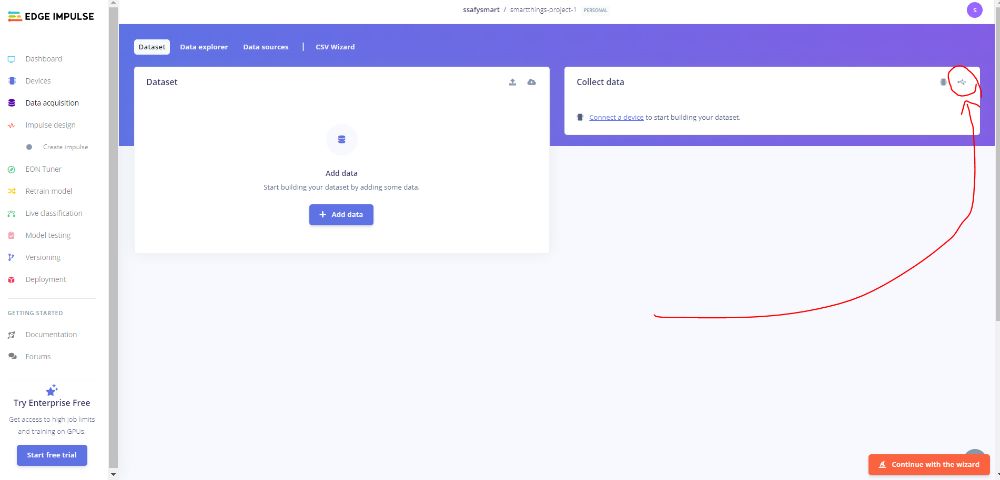
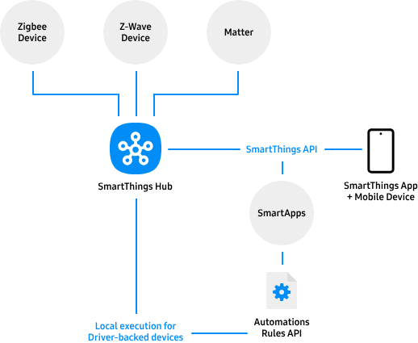
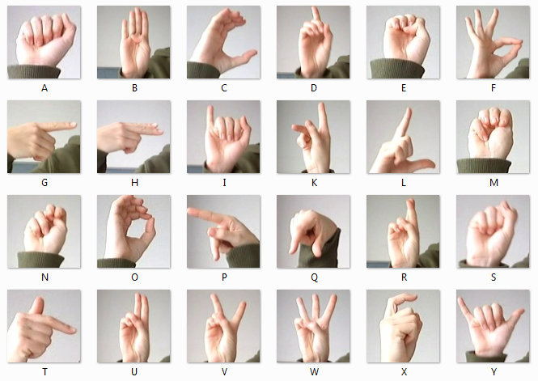

### 24.04.22
---

##### 중간 발표
- Tensorflow Lite를 활용한 온디바이스 머신러닝 기술 도입

##### 2차 교보재 신청
- ToF 센서 : SparkFun Qwiic ToF Imager - VL53L5CX
- Qwiic 쉴드 : SparkFun Qwiic Shield for Arduino Nano
- Qwiic 케이블 : JST SH 4핀 Qwiic 케이블 -100mm 
- 카메라 : Arducam IMX219 Wide Angle Camera Module for NVIDIA Jetson Nano

### 24.04.23 ~
---

##### ToF센서

- 사용 센서
    
    **VL53L5CX**
    
    - 8x8, 총 64개의 감지 존을 제공하여 한번에 물체의 위치를 정밀하게 식별
    - 최대 15Hz 프레임 속도
    - 최대 4미터까지 측정
        
        [VL53L5CX - STMicroelectronics](https://www.st.com/en/imaging-and-photonics-solutions/vl53l5cx.html)
        
        [Qwiic ToF Imager - VL53L5CX Hookup Guide - SparkFun Learn](https://learn.sparkfun.com/tutorials/qwiic-tof-imager---vl53l5cx-hookup-guide)
        
- 개발 방법
    - 방법 1 : 시간 많이 소요 🤨
        - 센서 Data 수집하기
        - Tensorflow 모델 만들기
        - Tensorflow lite로 변환하기
        - 아두이노에 배포하기
    
    - **방법 2 : 자동화되어 있어서 코드 작업 없이 간소화** ✅
        
        [expert-projects/novel-sensor-projects/tof-gesture-classification-arduino-rp2040-connect.md at main · edgeimpulse/expert-projects](https://github.com/edgeimpulse/expert-projects/blob/main/novel-sensor-projects/tof-gesture-classification-arduino-rp2040-connect.md)
        
        [Continuous motion recognition | Edge Impulse Documentation](https://edge-impulse.gitbook.io/docs/tutorials/end-to-end-tutorials/continuous-motion-recognition)
        
        - **Edge impulse 사이트 사용하기**
        - **센서 데이터 수집만 직접 하면 이후 데이터 처리와 학습을 Edge impulse를 활용해 배포할 수 있다.**

- 참고자료
    - 제스처
        
        
        
        [Gesture/Pattern Recognition Without Camera : TOF !](https://hackaday.io/project/180123-gesturepattern-recognition-without-camera-tof)
        
        [https://youtu.be/ufkdqY4NJMo?si=G3c6dsyh9Eh7nJqg&t=105](https://youtu.be/ufkdqY4NJMo?si=G3c6dsyh9Eh7nJqg&t=105)
        
    - 참고할 전체적인 개발 과정
        
        [expert-projects/novel-sensor-projects/tof-gesture-classification-arduino-rp2040-connect.md at main · edgeimpulse/expert-projects](https://github.com/edgeimpulse/expert-projects/blob/main/novel-sensor-projects/tof-gesture-classification-arduino-rp2040-connect.md)
        
    - 마우스 포인터
        
        [tofMouse - ESP32 and VL53L5CX based Gesture Mouse](https://www.youtube.com/watch?v=R3ijq8uh_zs)


- 개발
    
    [expert-projects/novel-sensor-projects/tof-gesture-classification-arduino-rp2040-connect.md at main · edgeimpulse/expert-projects](https://github.com/edgeimpulse/expert-projects/blob/main/novel-sensor-projects/tof-gesture-classification-arduino-rp2040-connect.md)
    
    - edge impulse 계정
        
        ```bash
        ssafysmartthings@gmail.com
        a409a409!
        ```
        
    - edge impulse에 아두이노 연결
        - 연결 방법 1
            
            arduino-cli 설치
            
            [arduino-cli_0.35.3_Windows_64bit.zip](./imgs/arduino-cli_0.35.3_Windows_64bit.zip)
            
            - 압축 풀고 환경변수 설정해야함
                
                [https://youtu.be/1jMWsFER-Bc?si=tKPhuDIAjY2ZSMxG](https://youtu.be/1jMWsFER-Bc?si=tKPhuDIAjY2ZSMxG)
                
            - arduino에 edge impulse 설정
                
                [arduino-nano-33-ble-sense.zip](./imgs/arduino-nano-33-ble-sense.zip)
                
                - 압축 풀고 windows 실행
                
                [Installation | Edge Impulse Documentation](https://edge-impulse.gitbook.io/docs/tools/edge-impulse-cli/cli-installation)
                
        - 연결 방법 2(크롬)
            
            

##### 스마트싱스




[SmartThings Community](https://community.smartthings.com/)

- 지그비
    - 라즈베리파이에서 xbee 사용
        
        [사물인터넷 기술의 기본 소양 : 아두이노와 라즈베리 파이간 지그비 연결하기](https://dataonair.or.kr/db-tech-reference/d-lounge/technical-data/?mod=document&uid=235899)
        
    - 지그비 모니터링 시스템 with jetson nano
        
        [arxiv.org](https://arxiv.org/pdf/2309.09332.pdf)
        
    
- Matter
    
    [Matter에 대한 모든 것! (매터 표준)](https://brunch.co.kr/@iotstlabs/226)
    
- 스마트싱스에 지그비로 연결하기
    - SmartThings에 연결하기 위해서는 디바이스 Edge를 만들어야한다.
        - 허브 연결해서 개발 전 알아낸 사실
            - SmartThings에 인증을 받아야할 수도 있다.
            - 정확한 것은 허브 연결해서 device driver 연결 창에 들어가봐야한다.
    - edge를 만들기 위한 SmartThings console 접속이 안된다.
        
        
        
    
    [https://www.youtube.com/watch?v=-qxG3cY2RhA](https://www.youtube.com/watch?v=-qxG3cY2RhA)
    
    [Tutorial | Creating Drivers for Zigbee Devices with SmartThings Edge](https://community.smartthings.com/t/tutorial-creating-drivers-for-zigbee-devices-with-smartthings-edge/229502)
    
    [Get Started with Hub Connected Devices | Developer Documentation | SmartThings](https://developer.smartthings.com/docs/devices/hub-connected/get-started#about-the-smartthings-edge-driver)
    
    [Global Environment — SmartThings Edge Device Drivers  documentation](https://developer.smartthings.com/docs/edge-device-drivers/global_environment.html)
    
    [Zigbee Libraries — SmartThings Edge Device Drivers  documentation](https://developer.smartthings.com/docs/edge-device-drivers/zigbee/zigbee.html)
    
- 가상 기기 만들기 Edge driver
    
    [How To Create Virtual Devices In SmartThings With EDGE Drivers!](https://www.youtube.com/watch?v=D_rb5C-7QK0&t=143s)
    
    [Tutorial | Creating Drivers for Zigbee Devices with SmartThings Edge](https://community.smartthings.com/t/tutorial-creating-drivers-for-zigbee-devices-with-smartthings-edge/229502)
    
- 스마트싱스 웹
    
    [](https://my.smartthings.com/advanced)
    
    - 테스트로 센서 두 개를 가상으로 연결했다.
        
        
        
    
- 갤럭시 업사이클 🙃
    
    [https://youtu.be/SYQEQj84ND8?si=Xc3YdAKLIGbGO-eB&t=46](https://youtu.be/SYQEQj84ND8?si=Xc3YdAKLIGbGO-eB&t=46)
    
    - 사용하지 않는 구형 갤럭시 기기의 센서를 활용해서 IoT 센서로 사용
    - 소리 센서, 조도 센서
    - 환경 & 비용 절감 효과!!!
- 관련 자료
    
    [GitHub - rambo350z/ST_API: Arduino Library for interacting with SmartThings API](https://github.com/rambo350z/ST_API)


##### 카메라

- 구현 방법
    - 정적인 제스처 ☹️
        
        
        
        - 자연스럽지 않다
        - source가 많다.
    - 동적인 제스처 😍
        
        [https://youtu.be/z8_oKw55tTM?si=vwlryUCoKCFrZUL4&t=49](https://youtu.be/z8_oKw55tTM?si=vwlryUCoKCFrZUL4&t=49)
        
        - 특징
            - 자연스럽다.
            - 데이터 수집 및 모델 생성 필요
        - 구현 방법
            - mediapipe로 손 바닥 ↔ 손 등 swipe하는 data 수집
            - tensorflow lite로 모델 생성
        - 참고 영상
            
            [https://youtu.be/eHxDWhtbRCk?si=TcufrtfM9wYskNGn](https://youtu.be/eHxDWhtbRCk?si=TcufrtfM9wYskNGn)
            
- 참고자료
    - 움직이는 손 제스처 인식
        
        [Dynamic Hand Gesture Recognition Based on a Leap Motion Controller and Two-Layer Bidirectional Recurrent Neural Network](https://www.mdpi.com/1424-8220/20/7/2106)