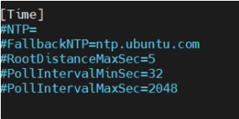
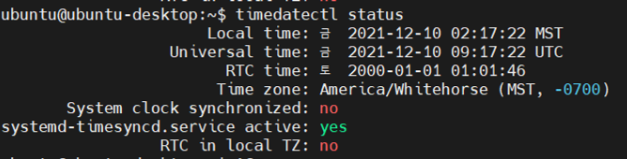

# 오늘의 깨달음

## 24.04.18
- 기능 명세서
  - 소비자를 위한 명세서
  - 소비자가 원하는 기능을 위한 명세서
  - 필요한 기능들 정리

- API 명세서
  - 프론트와 백엔드 개발을 위한 소통 명세서
  - 서로 주고 받는 API 약속
  - 요청과 응답에 대한 명칭 정의

- 프로그램 명세서
  - 개발자(백엔드)와의 소통을 명세서
  - 재사용되는 모듈별 정의

## 24.04.22
- 필요한 제품 구하기
- 디스플레이
  - 터치 디스플레이로 구매
  - 개발의 원활함을 위해
  - 디스플레이 사이즈는 10인치로
- 카메라
  - 사람 트래킹
- 초음파센서
  - 모션센싱 제어
- 마이크
  - 음성 명령 제어
  - 네이버 클로버 API이용
- 스마트싱스 허브
  - 우리 기기를 통해 다른 기기를 제어하기 위해
- 서보모터
  - 사람 트래킹에 따라 움직이기 위해
- 랜카드 / 안테나
  - Wifi 및 BT연결을 위해 구매

## 24.04.23
- gerrit 이용 정리
- gerrit 설정 이후 팀원에게 사용방법 전파

## 24.04.24

- 환경 구성 준비
  - 젯슨나노 보드
  - 전원 어댑터
  - HDMI 디스플레이와 HDMI 케이블
  - USB 키보드 및 마우스
  - MicroSD 카드 (운영 체제를 설치할 수 있도록)
  - 컴퓨터에 MicroSD 카드를 읽을 수 있는 리더
- 운영 체제 설치
  - NVIDIA의 JetPack SDK를 다운로드하고 MicroSD 카드에 이미지를 설치합니다.
  - MicroSD 카드를 젯슨나노에 삽입하고 전원을 켭니다.
  - 부팅이 완료되면 초기 설정을 수행합니다.
- 네트워크 연결
  - Wi-Fi 또는 이더넷 케이블을 사용하여 인터넷에 연결합니다.
- 시스템 업데이트
  - 터미널에서 sudo apt update 명령어를 사용하여 시스템을 업데이트합니다.
- 환경 설정
  - 필요에 따라 CUDA 및 다른 라이브러리를 설치하고 구성합니다.
  - 사용할 개발 도구를 설치하고 설정합니다.
- 기타 설정
  - 필요한 경우 시스템 설정을 조정하고 추가 소프트웨어를 설치합니다.

## 24.04.25
## 젯슨나노 vscode이용 ssh원격으로 연결

[https://velog.io/@kk21/VScode-원격-접속-연결하기](https://velog.io/@kk21/VScode-%EC%9B%90%EA%B2%A9-%EC%A0%91%EC%86%8D-%EC%97%B0%EA%B2%B0%ED%95%98%EA%B8%B0)

## 젯슨나노 기기 끄는 명령어

```cpp
sudo shutdown now
```

## 시간 동기화 문제

nft, chrony 방법을 적용해봤지만 결국 안댐

아마 ssafy랜선을 이용하는게 원인으로 예상

이런식으로 강제 설정(부팅시마다)

```cpp
sudo date --set="2024-04-25 15:30:00"
```






## 젯슨나노 우분투 환경 업그레이드(20.04)

https://www.wonbeomjang.kr/blog/2023/jetson-nano-ubuntu/

https://whiteknight3672.tistory.com/342

yolov8버전을 쓰기 위해 우분투 20.04로 업데이트가 필요

하지만 nvidia에서는 공식적으로 18.04까지만 지원

⇒ 사람들이 만든 우분투 20.04버전의 이미지를 새로 구울 필요가 있음

- https://github.com/Qengineering/Jetson-Nano-Ubuntu-20-image
1. 20.04 이미지 파일을 깃헙을 통해 다운로드
2. balenaEtcher를 통해 이미지를 sd카드에 flash
3. flash한 이미지를 젯슨나노에 삽입하면 설치
    1. password : jetson
    2. sha256sum: 492d6127d816e98fdb916f95f92d90e99ae4d4d7f98f58b0f5690003ce128b34
    3. md5sum: f2181230622b81b6d882d4d696603e04

특이점

- 첫 부팅시에는 DC전원이 필요
- USB 전원으로만 받을 시에 전력이 부족하여 부팅이 되지 않는 문제 발생
    - 특히 디스플레이를 연결하게 된다면 아예 부팅이 되지 않는 상황도 발생

## 24.04.26
- 우분투 환경설정을 하다보면 리눅스 환경이다보니 윈도우랑 달리 충돌이 많이 나는 경우 존재
- 모터드라이버로 현재 조절할 수 없는 문제가 있음(24V전원 필요)
  - 직접 젯슨나노에 연결하여 함
- DC전원을 통해 전원공급 받으며 서보모터, 디스플레이 제어 성공