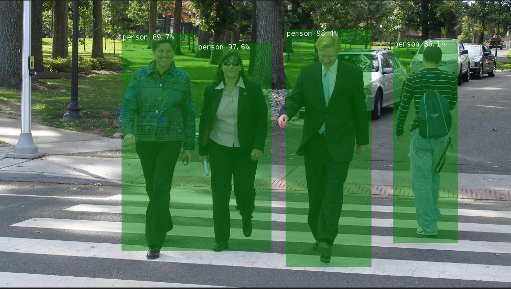
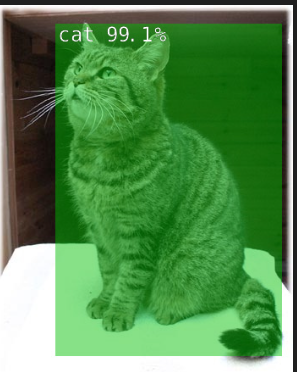
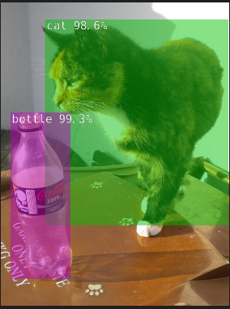

## 실시간 물체 탐지
1. SSD-MobileNet-v2
SSD-MobileNet-v2는 실시간 객체 감지를 위해 설계된 경량화된 딥러닝 모델입니다. "SSD"는 Single Shot MultiBox Detector의 약자로, 한 번의 추론으로 이미지 내 모든 객체의 위치와 분류를 예측할 수 있습니다. "MobileNet-v2"는 모델의 백본 네트워크로, 효율적인 계산을 위해 설계되었으며, 이는 모바일과 임베디드 시스템에서의 활용에 최적화되어 있습니다. 이 조합은 빠르면서도 정확한 객체 감지 성능을 제공하며, 자율 주행 차량, 로보틱스, 비디오 분석 등 다양한 분야에서 사용됩니다.

2. TensorRT
TensorRT는 NVIDIA가 개발한 고성능 딥러닝 추론(인퍼런스) 엔진입니다. 이 소프트웨어는 모델을 최적화하여 GPU에서 실행할 때 낮은 지연시간과 높은 처리량을 달성할 수 있도록 돕습니다. TensorRT는 네트워크의 레이어 병합, 정밀도 조정, 커널 최적화 등을 수행하여 실행 시간과 자원 사용을 줄입니다. Jetson과 같은 임베디드 디바이스에서는 빠른 응답 시간과 에너지 효율성이 중요하기 때문에, TensorRT의 역할이 매우 중요합니다.

3. GStreamer
GStreamer는 파이프라인 기반의 멀티미디어 프레임워크로, 오디오 및 비디오 처리에 사용됩니다. 이 프레임워크는 스트리밍 미디어 애플리케이션을 개발하기 위한 강력한 도구 제공을 목적으로 하며, 다양한 미디어 형식을 지원하고 다양한 플러그인을 통해 기능을 확장할 수 있습니다. GStreamer는 플러그 앤 플레이 방식의 파이프라인 구성 요소를 제공하여, 비디오 캡처, 인코딩, 필터링, 디코딩, 출력 등의 과정을 유연하게 처리할 수 있습니다.

4. CUDA
CUDA는 Compute Unified Device Architecture의 약자로, NVIDIA에서 개발한 병렬 컴퓨팅 플랫폼 및 API입니다. CUDA를 사용하면 개발자들이 NVIDIA GPU의 강력한 계산 능력을 활용하여 복잡한 계산 문제를 효율적으로 해결할 수 있습니다. 딥러닝, 과학적 계산, 이미지 처리 등 다양한 고성능 컴퓨팅 작업에 널리 사용됩니다. CUDA는 GPU 내의 수천 개의 코어를 활용하여 대량의 데이터와 연산을 병렬로 처리할 수 있게 해 주어, CPU만 사용할 때보다 훨씬 빠른 성능을 제공합니다.

이러한 기술들은 각각의 특성과 강점을 가지고 있으며, Jetson Nano와 같은 장치에서 AI 애플리케이션을 구현할 때 중요한 역할을 합니다. 이들 기술을 통합하여, 고성능의 지능형 시스템을 개발할 수 있습니다.