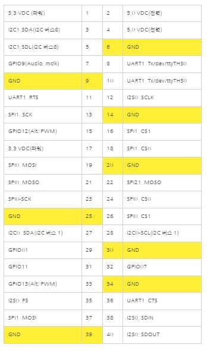
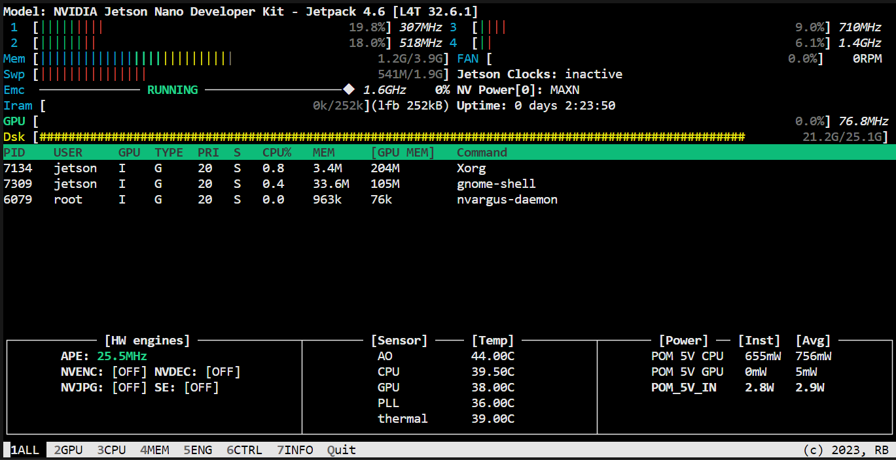
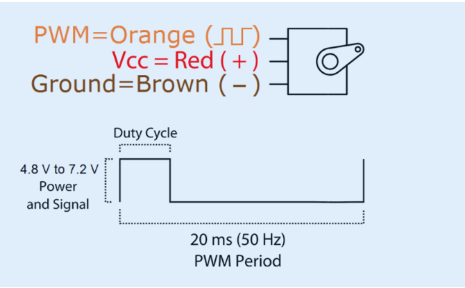

## Jetson nano GPIO
- 
- UART(직렬 시리얼 통신)
  - 병렬 데이터의 형태를 직렬 방식으로 전환​하여 데이터를 전송하는 방법
- I2C(Inter-Intergrated Circuit)
  - 두개의 신호선으로 다수의 I2C통신을 지원하는 디바이스와 데이터를 송/수신 할 수 있는 통신 방법
- SPI(Serial Peripheral Interface)
  - 직렬 주변기기 인터페이스로 CPU와 다수의 CPU들 또는 CPU와 다수의 주변장치 사이에서 고속으로 데이터를 동기 전송할때 사용하는 직렬 통신 방법
  - 장치들은 마스터 슬레이브 모드로 통신하며 여러 슬레이브 장치들은 개별 슬레이브 셀렉트 라인과 함께 동작 가능
- PWM(Pulse Width Modulation)
  - 펄스의 폭을 조정하여 부하에 전력의 크기를 조절하는 것
  - 보통 내장된 타이머 카운터를 이용
  - 장점 : ​기존의 구조에서 많은 변화를 주지않고 프로그래밍만으로 손쉽게 제어할 수 있음

- 4가지 논리신호
  - SCLK : 직렬 클럭 으로 Slave를 선택하는 신호
  - Clock을 전송해주는 신호 MOSI,MISO
    - MOSI : 마스터출력, 슬레이브 입력 (Master 기준으로 입력 신호)
    - MISO: 마스터 입력, 슬레이브 출력 (Master 기준으로 출력 신호)
  - SS: 슬레이브 선택핀으로 각 슬레이브 선택 가능
    - 간단하게 마스터에서 슬레이브로 ss핀을 통해 신호를 받을 수 있게 활성화 시켜준다고 생각
  - 참고 : ​SCLK,MOSI,MISO핀들은 각 슬레이브에 공유되어 연결, 슬레이브 선택 핀인 SS만이 각각 따로 연결
​
## 메모리 확인

1. **tegrastats**:
    - Jetson 플랫폼에 특화된 **`tegrastats`** 명령어를 사용하여 GPU와 CPU 사용량, 메모리 사용량 등을 실시간으로 확인 가
    
    ```bash
    sudo /usr/bin/tegrastats
    ```
    
    - 출력에서 **`GR3D_FREQ`** 라는 부분이 GPU 사용률을 나타냅니다. 예를 들어 **`GR3D_FREQ 99%@921`**는 GPU가 99%의 용량으로 921MHz에서 작동하고 있음을 의미합니다.
    - 
2. **nvidia-smi**:
    - 일반적인 NVIDIA GPU에서는 **`nvidia-smi`** 명령어로 GPU 상태를 확인할 수 있지만, Jetson 시리즈는 이 명령어를 지원하지 않습니다. 대신, Jetson용 특화 도구인 **`tegrastats`**를 사용해야 합니다.
3. **jtop**:
    - **`jtop`**은 Jetson 디바이스를 위한 시스템 모니터 도구로, CPU, GPU, 메모리, 전력 사용 등을 그래픽 인터페이스로 표시
    - **`jtop`**을 설치 명령어
        
        ```bash
        sudo -H pip install jetson-stats
        ```
        
    - 설치 후에는 터미널에서 **`jtop`**을 입력하여 실행
    - 
## 모니터 연결 확인
- xrandr
  - 연결이 되지 않았을 시
  - export DISPLAY=:0.0


## 카메라 연결
- nvarguscamerasrc를 통한 파이프라인이 제대로 구성되어 있는 지 확인 코드
  - gst-launch-1.0 nvarguscamerasrc sensor_id=0 ! queue ! nvoverlaysink
- 젯슨나노의 어떤 포트에 연결되어 있는지 확인
  - ls -l /dev/video*

## 서보모터
- 모터사양
```
Weight : 55g
Dimension: 40.7 x 19.7 x 42.9 mm appro
Stall torque: 9.4 kgf·cm (4.8 V ), 11 kgf·cm (6 V)
Operating speed: 0.17 s/60º (4.8 V), 0.14 s/60º (6 V)
Operating voltage: 4.8 V a 7.2 V
Running Current : 500 mA – 900 mA (6V)
Stall Current : 2.5 A (6V)
Dead band width: 5 μs
Stable and shock proof  double ball bearing design
Temperature range: 0 ºC - 55 ºC 
```

