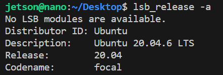
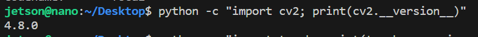
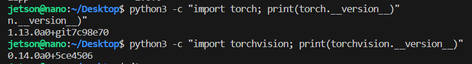
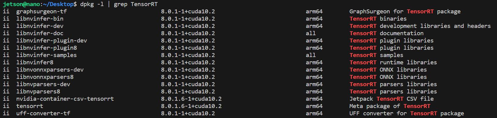
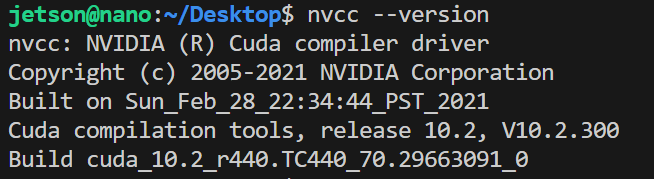
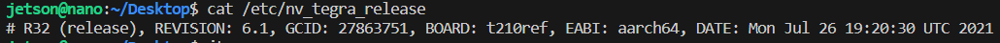

## Jetson 버전

### 버전 확인 코드(우분투 환경)
```bash
lsb_release -a # 우분투 버전
python -c "import cv2; print(cv2.__version__)" # openCV 버전
python3 -c "import torch; print(torch.__version__)" # PyTorch 버전
python3 -c "import torchvision; print(torchvision.__version__)" # TorchVision 버전
dpkg -l | grep TensorRT # TensorRT 버전
nvcc --version # CUDA 버전
cat /etc/nv_tegra_release # Jetpack 버전
```
### 우분투 버전


### openCV버전


### PyTorch, Torchvision 버전


### TensorRT 버전


### CUDA 버전


### Jetpack 버전
